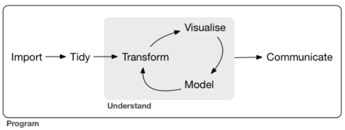
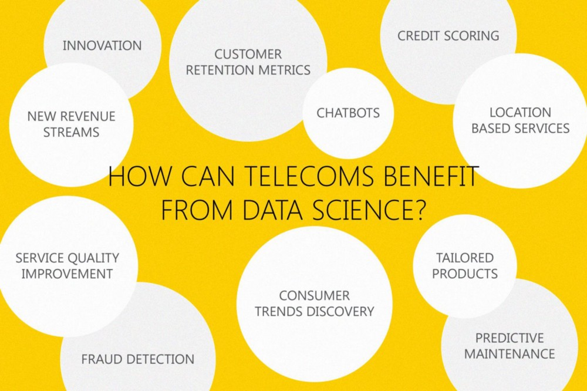

```{r setup, include=FALSE}
knitr::opts_chunk$set(echo = TRUE)
def.chunk.hook  <- knitr::knit_hooks$get("chunk")
knitr::knit_hooks$set(chunk = function(x, options) {
  x <- def.chunk.hook(x, options)
  ifelse(options$size != "normalsize", paste0("\\", options$size,"\n\n", x, "\n\n \\normalsize"), x)
})

```


# Sobre o Professor
## Sobre o Professor

- Análise Macro Founder
- BS and MSc in Economics
- DS Specialization
- R Specialist


# Objetivo do nosso Curso
## Objetivo do nosso Curso

Capacitar as equipes nas análises estatísticas com alto volume de dados e múltiplas fontes, permitindo que análises complexas sejam feitas em um curto espaço de tempo, beneficiando as tomadas de decisões operacionais e executivas.

# Período e Sistemática
## Período e Sistemática

Nos encontraremos aqui dos dias 11/03 a 15/05, das 9h às 18h.

\bigskip

- 9h às 11h
- Intervalo de 15min
- 11h15 às 13h
- Almoço 
- 14h às 16h
- Intervalo de 15min
- 16h15 às 18h

# Introdução
## Introdução

O avanço da informática e das telecomunicações possibilitou o armazenamento e a distribuição de conjuntos de dados cada vez mais complexos. Lidar com essas bases de dados exigiu a sistematização de diversas técnicas de coleta, tratamento, análise e apresentação de dados. 

\bigskip

Essa sistematização de técnicas deu origem ao que hoje chamamos de \textbf{data science}, cujo objetivo principal é extrair informações úteis de conjuntos de dados aparentemente confusos. 

## Introdução

\begin{block}{Aplicações interessantes:}

\begin{itemize}

  \item Identificar mensagens indesejáveis em um e-mail (spam);
  
  \item Segmentação do comportamento de consumidores para propagandas direcionadas;
  
  \item Redução de fraudes em transações de cartão de crédito;
  
  \item Predição de eleições;
  
  \item Otimização do uso de energia em casas ou prédios;
  
  \item etc, etc, etc...

\end{itemize}
\end{block}


## Introdução

Ao coletar dados, introduzimos em uma plataforma de Análise de Dados (como o R) informações coletadas no mundo real. Seja vindas de  base de dados prontas ou adquiridas minerando dados abertos em sites. Depois tratamos as informações para que sejam devidamente legíveis para um computador e bem formatadas para nosso próprio entendimento. Então começamos a análise propriamente dita. Visualizamos os dados, procurando perguntas interessantes e padrões, depois avaliamos nossas intuições com modelos estatísticos. Por fim, comunicamos nossos achados - afinal de pouco importa achar algo somente para si.

## Introdução

Com base em @r4ds, podemos sistematizar o processo de compreensão dos dados conforme a figura abaixo.

\bigskip



# Coleta e Tratamento
## Coleta e Tratamento

Dados podem estar dispostos em diferentes formatos:

\bigskip

\begin{itemize}

  \item Excel;
  
  \item XML;
  
  \item JSON;
  
  \item txt;
  
  \item HTML;
  
  \item MySQL;
  
  \item Formatos proprietários (Weka, Stata, Minitab, Octave, SPSS, SAS, etc).

\end{itemize}

## Coleta e Tratamento

Dados precisam ser tratados:

\bigskip

\begin{itemize}

  \item Limpeza de dados;
  
  \item Tratamento de \emph{missing values};
  
  \item Construção de números índices;
  
  \item Deflacionar valores correntes;
  
  \item Obtenção de taxas de crescimento, a partir de comparações mensais, interanuais, acumuladas em 12 meses, etc;
  
  \item Tratando tendências;
  
  \item Dessazonalização;
  
  \item Obtendo subconjuntos (\emph{subsetting}) relevantes;
  
  \item Classificando dados de acordo com algum critério;
  
  \item Transformando dados de acordo com alguma operação.
  
\end{itemize}


# Exploração
## Exploração

A exploração de dados é a arte de analisar seus dados, gerando hipóteses rapidamente, testando-os rapidamente, repetindo-os várias vezes. O objetivo da exploração de dados é gerar muitos leads promissores que você poderá explorar mais tarde com mais profundidade.

# Modelagem
## Modelagem

O objetivo da modelagem é capturar a essência de um conjunto de dados. Alguns exemplos de modelos que podem ser utilizados para isso:

\begin{itemize}

  \item Modelos ARIMA;
  
  \item Regressão linear;
  
  \item Árvores de regressão;
  
  \item Neural Network;
  
  \item Support Vector Machine;
  
  \item Naive Bayes;
  
  \item etc, etc, etc.

\end{itemize}

# Comunicação
## Comunicação

Os resultados encontrados devem ser compartilhados com gestores, clientes ou colaboradores. Para os primeiros grupos, não se faz necessário mostrar o \texttt{código} utilizado, enquanto para o segundo isso deve ser uma característica importante. Por isso, é preciso encontrar uma plataforma que consiga integrar as quatro etapas da análise de dados, gerando como \texttt{produto} um {documento reprodutíve}, que unam \textbf{código} e \textbf{texto}. Seja o código visível ou não para a ponta final. 


# Tipos de Cientistas de Dados
## Tipos de Cientistas de Dados

Com a difusão da área de \emph{data science}, é muito comum que as empresas estejam atrás de profissionais multidisciplinares, que consigam cumprir aquelas quatro etapas do processo. Como começamos a ver, contudo, essas quatro etapas envolvem diversos conhecimentos que são difíceis de serem encontrados em um único profissional. Não é que eles não existam, de fato, há alguns \emph{unicórnios} por aí, mas são raros de serem encontrados. 

## Tipos de Cientistas de Dados

De maneira geral, há \emph{tipos} de cientistas de dados. Podemos diferenciá-lo da seguinte forma:

\bigskip

- \emph{Analistas de BI}: raramente codificam (podem até utilizar GUIs para acessar bancos de dados, para que nem sequer escrevam consultas SQL - a ferramenta faz isso para eles; no entanto, eles precisam entender o esquema do banco de dados.), são os responsáveis por definir métricas e trabalhar com o gerenciamento para identificar fontes de dados ou para criar dados. Eles também trabalham na criação de \emph{dashboards} de dados com vários usuários finais em mente, desde segurança, finanças, vendas, marketing até executivos. Muitos têm um diploma de MBA;


## Tipos de Cientistas de Dados

- \emph{Engenheiros de Dados}: obtêm os requisitos desses analistas de BI para configurar os pipelines de dados e têm o fluxo de dados em toda a empresa e fora dele, com pequenos pedaços (normalmente dados resumidos) terminando em vários laptops de funcionários para análise ou relatório. Eles trabalham com administradores de sistema para configurar o acesso a dados, personalizado para cada tipo de usuário. Eles estão familiarizados com o data warehousing, os diferentes tipos de infraestrutura em nuvem (interna, externa, híbrida) e sobre como otimizar as transferências e o armazenamento de dados, equilibrando a velocidade com o custo e a segurança. Eles estão muito familiarizados com o funcionamento da Internet, bem como com a integração e padronização de dados. Eles são bons em programar e implantar sistemas projetados pelo terceiro tipo de cientistas de dados, descrito abaixo. Às vezes, particularmente para funções seniores, eles são chamados de arquitetos de dados;

## Tipos de Cientistas de Dados

- \emph{ML Data Scientists}: Os cientistas de dados de aprendizado de máquina projetam e monitoram sistemas preditivos e de pontuação, têm um grau avançado, são especialistas em todos os tipos de dados (grandes, pequenos, em tempo real, não-estruturados etc.) Eles executam muitos algoritmos, testes, ajustes e manutenção. Eles sabem como selecionar / comparar ferramentas e fornecedores, e como decidir entre o aprendizado de máquina caseiro ou ferramentas (fornecedor ou código aberto). Eles geralmente desenvolvem protótipos ou provas de conceitos, que acabam sendo implementados no modo de produção por engenheiros de dados. Suas linguagens de programação de escolha são Python e R;

## Tipos de Cientistas de Dados

- \emph{Analistas de Dados}: Os analistas de dados são cientistas juniores de dados que fazem muita análise de números, limpeza de dados e trabalho em análises únicas e geralmente projetos de curto prazo. Eles interagem e suportam cientistas de dados de BI ou ML. Eles às vezes usam técnicas de modelagem estatística mais avançadas.
  

# Conhecimentos necessários
## Conhecimentos necessários

Uma pergunta muito frequente associada à data science é justamente o que é preciso saber para se tornar um cientista de dados. Como vimos acima, nem todos os profissionais que trabalham com ciência de dados são iguais. Logo, não há uma cesta de conhecimento única para se trabalhar na área. Analistas de BI, por exemplo, vão estar muito mais preocupados com a criação e apresentação de indicadores de desempenho; enquanto engenheiros de dados estarão mais frequentemente envolvidos com a infraestrutura necessária para armazenar e distribuir conjuntos de dados entre diferentes perfis de usuários. 

## Conhecimentos necessários

De maneira geral, cientistas de dados são altamente qualificados, tendo mestrado ou doutorado em áreas como matemática, estatística, economia, ciência da computação, etc, de modo que disciplinas como cálculo, estatística descritiva e inferência estatística são conhecidas. Ademais, têm conhecimento de uma ou mais linguagens de programação, como R e Python. Outros conhecimentos específicos, como Hadoop, SQL, Apache Spark ou algoritmos de machine learning vão depender do tipo de tarefa e/ou estrutura de dados a que o profissional está submetido.

# Tipos de Questões
## Tipos de Questões

* in order of difficulty: ***Descriptive*** $\rightarrow$ ***Exploratory*** $\rightarrow$ ***Inferential*** $\rightarrow$ ***Predictive*** $\rightarrow$ ***Causal*** $\rightarrow$ ***Mechanistic***

\bigskip

* **Análise Descritiva** = describe set of data, interpret what you see (census, Google Ngram)
* **Análise Exploratória** = discovering connections (correlation does not = causation)
* **Análise Inferencial** = use data conclusions from smaller population for the broader group
* **Análise Preditiva** = use data on one object to predict values for another (if X predicts Y, does not = X cause Y)
* **Análise Causal** = how does changing one variable affect another, using randomized studies, Strong assumptions, golden standard for statistical analysis
* **Análise Mecanicista** = understand exact changes in variables in other variables, modeled by empirical equations (engineering/physics)

# DS e Telecom
## DS e Telecom

Não importa como você olhe, o setor de telecomunicações está sob muita pressão. Startups podem fornecer serviços ágeis e on-demand, como as de telecomunicações, os players OTT mudaram a forma como as pessoas consomem o conteúdo, novos modelos de negócios e tecnologias estão constantemente atrapalhando o mercado.

## DS e Telecom

Para acompanhar essa pressão, as empresas de telecomunicações estão investindo pesadamente em áreas fora do seu core business, agregando novo valor através de seus serviços e criando fluxos de receita adicionais para ficar ao lado de seu comércio tradicional. Para não ficar para trás e se tornar apenas um mediador de serviços inovadores, eles estão se adaptando e adotando setores emergentes e inovadores.

## DS e Telecom



# Um exemplo simples
## Um exemplo simples

Cerca de 80$\%$ do trabalho de um cientista de dados envolvem a *exploração* e o *entendimento* dos dados. Para ilustrar, vamos ver um exemplo envolvendo uma base de dados simples de **carros usados**. 

\bigskip

```{r, echo=T, eval=T, results='asis', fig.cap='', fig.width=8, fig.height=4, fig.align='center', out.width=".7\\linewidth", warning=FALSE, message=FALSE, size='tiny'}

## data exploration example using used car data
usedcars <- read.csv("usedcars.csv", stringsAsFactors = FALSE)

```


## Um exemplo simples

```{r, echo=T, eval=T, results='markup', fig.cap='', fig.width=8, fig.height=4, fig.align='center', out.width=".7\\linewidth", warning=FALSE, message=FALSE, size='tiny'}

# get structure of used car data
str(usedcars)


```

## Um exemplo simples

```{r, echo=T, eval=T, results='markup', fig.cap='', fig.width=8, fig.height=4, fig.align='center', out.width=".7\\linewidth", warning=FALSE, message=FALSE, size='tiny'}

## Exploring numeric variables -----
# summarize numeric variables
summary(usedcars$year)
summary(usedcars[c("price", "mileage")])


```

## Um exemplo simples

```{r, echo=T, eval=T, results='markup', fig.cap='', fig.width=8, fig.height=4, fig.align='center', out.width=".7\\linewidth", warning=FALSE, message=FALSE, size='tiny'}

# the min/max of used car prices
range(usedcars$price)

# the difference of the range
diff(range(usedcars$price))

# IQR for used car prices
IQR(usedcars$price)

# use quantile to calculate five-number summary
quantile(usedcars$price)


```

## Um exemplo simples

```{r, echo=T, eval=T, results='markup', fig.cap='', fig.width=8, fig.height=4, fig.align='center', out.width=".7\\linewidth", warning=FALSE, message=FALSE, size='tiny'}

# the 99th percentile
quantile(usedcars$price, probs = c(0.01, 0.99))

# quintiles
quantile(usedcars$price, seq(from = 0, to = 1, by = 0.20))


```

## Um exemplo simples

```{r, echo=T, eval=T, results='asis', fig.cap='', fig.width=8, fig.height=4, fig.align='center', out.width=".7\\linewidth", warning=FALSE, message=FALSE, size='tiny'}

# boxplot of used car prices and mileage
boxplot(usedcars$price, main="Boxplot of Used Car Prices",
      ylab="Price ($)")


```

## Um exemplo simples

```{r, echo=T, eval=T, results='asis', fig.cap='', fig.width=8, fig.height=4, fig.align='center', out.width=".7\\linewidth", warning=FALSE, message=FALSE, size='tiny'}

boxplot(usedcars$mileage, main="Boxplot of Used Car Mileage",
      ylab="Odometer (mi.)")


```

## Um exemplo simples

```{r, echo=T, eval=T, results='asis', fig.cap='', fig.width=8, fig.height=4, fig.align='center', out.width=".7\\linewidth", warning=FALSE, message=FALSE, size='tiny'}

# histograms of used car prices and mileage
hist(usedcars$price, main = "Histogram of Used Car Prices",
     xlab = "Price ($)")


```

## Um exemplo simples

```{r, echo=T, eval=T, results='asis', fig.cap='', fig.width=8, fig.height=4, fig.align='center', out.width=".7\\linewidth", warning=FALSE, message=FALSE, size='tiny'}

hist(usedcars$mileage, main = "Histogram of Used Car Mileage",
     xlab = "Odometer (mi.)")


```

## Um exemplo simples

```{r, echo=T, eval=T, results='markup', fig.cap='', fig.width=8, fig.height=4, fig.align='center', out.width=".7\\linewidth", warning=FALSE, message=FALSE, size='tiny'}

# variance and standard deviation of the used car data
var(usedcars$price)
sd(usedcars$price)
var(usedcars$mileage)
sd(usedcars$mileage)


```

## Um exemplo simples

```{r, echo=T, eval=T, results='markup', fig.cap='', fig.width=8, fig.height=4, fig.align='center', out.width=".7\\linewidth", warning=FALSE, message=FALSE, size='tiny'}

## Exploring numeric variables -----
# one-way tables for the used car data
table(usedcars$year)
table(usedcars$model)
table(usedcars$color)


```

## Um exemplo simples

```{r, echo=T, eval=T, results='markup', fig.cap='', fig.width=8, fig.height=4, fig.align='center', out.width=".7\\linewidth", warning=FALSE, message=FALSE, size='tiny'}

# compute table proportions
model_table <- table(usedcars$model)
prop.table(model_table)


```

## Um exemplo simples

```{r, echo=T, eval=T, results='markup', fig.cap='', fig.width=8, fig.height=4, fig.align='center', out.width=".7\\linewidth", warning=FALSE, message=FALSE, size='tiny'}

# round the data
color_table <- table(usedcars$color)
color_pct <- prop.table(color_table) * 100
round(color_pct, digits = 1)


```

## Um exemplo simples

```{r, echo=T, eval=T, results='asis', fig.cap='', fig.width=8, fig.height=4, fig.align='center', out.width=".7\\linewidth", warning=FALSE, message=FALSE, size='tiny'}

## Exploring relationships between variables -----
# scatterplot of price vs. mileage
plot(x = usedcars$mileage, y = usedcars$price,
     main = "Scatterplot of Price vs. Mileage",
     xlab = "Used Car Odometer (mi.)",
     ylab = "Used Car Price ($)")


```

## Um exemplo simples

```{r, echo=T, eval=T, results='asis', fig.cap='', fig.width=8, fig.height=4, fig.align='center', out.width=".7\\linewidth", warning=FALSE, message=FALSE, size='tiny'}

# new variable indicating conservative colors
usedcars$conservative <-
  usedcars$color %in% c("Black", "Gray", "Silver", "White")

# checking our variable
table(usedcars$conservative)


```

