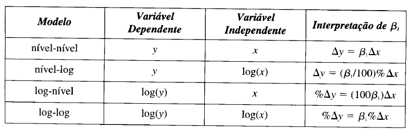

```{r setup, include=FALSE}
knitr::opts_chunk$set(echo = TRUE)
def.chunk.hook  <- knitr::knit_hooks$get("chunk")
knitr::knit_hooks$set(chunk = function(x, options) {
  x <- def.chunk.hook(x, options)
  ifelse(options$size != "normalsize", paste0("\\", options$size,"\n\n", x, "\n\n \\normalsize"), x)
})

```


# Introdução 
## Introdução 

Estamos interessados em estimar os parâmetros populacionais $\beta_0$ e $\beta_1$ de um modelo de regressão simples \begin{align} y = \beta_0 + \beta_1 x + u \label{eq01} \end{align} a partir de uma amostra aleatória de $y$ e $x$. De acordo com \cite{wooldridge2}, os estimadores de Mínimos Quadrados Ordinários (MQO) serão \begin{subequations} \begin{align} \hat{\beta}_0 &= \hat{y} - \hat{\beta_1} \bar{x} \\ \hat{\beta_1} &= \frac{Cov(x,y)}{Var{x}}. \end{align} \end{subequations} 

## Introdução 

Baseado nos parâmetros estimados, a reta de regressão será \begin{align} \hat{y} = \hat{\beta}_0 + \hat{\beta}_1 x. \end{align} Para uma dada amostra, nós precisaremos calcular as quatro estatísticas $\bar{y}$, $\bar{x}$, $Cov(x,y)$ e $Var(x)$ e colocá-las nessas equações. Para ilustrar, vamos considerar o seguinte exemplo. 

## Introdução 

\textbf{Salários de CEOs e Retornos sobre o patrimônio}

\bigskip

Vamos considerar o exemplo 2.3 de \cite{wooldridge2} sobre \emph{Salários de CEOs e Retornos sobre o patrimônio}. Para isso, considere o seguinte modelo \begin{align} salary = \beta_0 + \beta_1 roe + u \end{align} onde $salary$ é o salário anual de CEO em milhares de dólares e $roe$ é o retorno médio sobre o patrimônio em percentual. O parâmetro $\beta_1$ irá medir a variação no salário anual quando o retorno médio sobre o patrimônio aumentar em um ponto percentual. Para estimar esse modelo, podemos utilizar o conjunto de dados \texttt{ceosal1}. 

## Introdução 

```{r, echo=T, eval=T, results='markup', fig.cap='', fig.width=8, fig.height=4, fig.align='center', out.width=".8\\linewidth", warning=FALSE, message=FALSE, size='tiny'}

data(ceosal1, package='wooldridge')
attach(ceosal1)


```

Uma vez que tenhamos carregado o conjunto de dados, podemos calcular manualmente os parâmetros $\beta_0$ e $\beta_1$, como abaixo.

## Introdução 

```{r, echo=T, eval=T, results='markup', fig.cap='', fig.width=8, fig.height=4, fig.align='center', out.width=".8\\linewidth", warning=FALSE, message=FALSE, size='tiny'}

# Cálculo manual dos parâmetros
b1hat = cov(roe,salary)/var(roe)
b1hat
b0hat = mean(salary) - b1hat*mean(roe)
b0hat


```

## Introdução 

Isto é, a **reta de regressão** será dada por \begin{align} \hat{salary} = `r round(b0hat,4)` + `r round(b1hat,4)` * roe \end{align} o que pode ser facilmente obtido com o código abaixo:

```{r, echo=T, eval=T, results='markup', fig.cap='', fig.width=8, fig.height=4, fig.align='center', out.width=".8\\linewidth", warning=FALSE, message=FALSE, size='tiny'}

lm(salary ~ roe)


```

## Introdução 

Implicando que para um $roe = 0$, teremos um salário previsto de US\$ `r round(b0hat,3)`, que é o intercepto. Ademais, se $\Delta roe = 1$, então $\Delta salary = US\$ `r round(b1hat,3)`$. Podemos, por fim, desenhar a reta de regressão com o código abaixo.

```{r, echo=T, eval=T, results='markup', fig.cap='', fig.width=8, fig.height=4, fig.align='center', out.width=".8\\linewidth", warning=FALSE, message=FALSE, size='tiny'}

CEOregress = lm(salary ~ roe)
plot(roe, salary, ylim=c(0,4000))
abline(CEOregress, col='red')


```

## Introdução 

O **modelo de regressão linear**, tipicamente estimado por *Mínimos Quadrados Ordinários (MQO)*, é a base da estatística aplicada. O modelo é \begin{align} y_i = x_{i}^{T} \beta + \varepsilon_i \quad i = 1,...,n. \end{align} ou, na forma matricial, \begin{align} y = X \beta + \varepsilon \end{align} onde $y$ é um vetor $n \times 1$ contendo a variável dependente, $X = (x_1, ..., x_n)$ é uma matriz $n \times k$ de regressores, $\beta$ é um vetor $k \times 1$ de coeficientes e $\varepsilon$ é um vetor $n \times 1$ de termos de erro.

## Introdução

Suposições sobre $\varepsilon$ dependem do contexto. Para dados **cross section**, $E(\varepsilon|X) = 0$ (exogeneidade) e $Var(\varepsilon|X) = \sigma^2 I$ (homocedasticidade condicional e ausência de autocorrelação) são comuns. Já para **séries temporais**, exogeneidade é algo mais complicado, sendo substituído por algo como $E(\varepsilon_j|x_i) = 0, i \leq j$. 

\bigskip

De modo a fixar as notações, temos que $\hat{\beta} = (X^T X)^{-1} X^T y$ denota o estimador de MQO para $\beta$. Os valores estimados serão dados por $\hat{y} = X \hat{\beta}$, os resíduos serão dados por $\hat{\varepsilon} = y - \hat{y}$ e a soma dos quadrados dos resíduos por $\hat{\varepsilon}^T \hat{\varepsilon}$.^[Para maiores detalhes sobre o modelo de regressão linear, ver @greene2003econometric, @sw, @wooldridge2 ou @verbeek.] 

# Regressão Linear Simples
## Regressão Linear Simples

Vamos continuar nosso entendimento de **regressões simples** com um pequeno exemplo retirado de @sw, disponível no pacote **AER**, que pode ser carregado e transformado como abaixo. 

```{r, echo=T, eval=T, results='markup', fig.cap='', fig.width=8, fig.height=4, fig.align='center', out.width=".8\\linewidth", warning=FALSE, message=FALSE, size='tiny'}

library(AER)
data("Journals")
journals = Journals[, c("subs", "price")]
journals$citeprice = Journals$price/Journals$citations
summary(journals)

```

## Regressão Linear Simples

Podemos estar interessados em estimar o efeito do preço de uma citação sobre o número de assinantes. Isto é, \begin{align} log(subs)_i = \beta_1 + \beta_2 log(citeprice)_i + \varepsilon_i. \label{eq3} \end{align} A equação \ref{eq3} pode ser estimada e plotada (a reta de regressão) com o seguinte código.

```{r, echo=T, eval=T, results='asis', fig.cap='', fig.width=8, fig.height=4, fig.align='center', out.width=".7\\linewidth", warning=FALSE, message=FALSE, size='tiny'}

plot(log(subs) ~ log(citeprice), data = journals)
jour_lm <- lm(log(subs) ~ log(citeprice), data = journals)
abline(jour_lm)

```

## Regressão Linear Simples

O gráfico pode ficar um pouco mais interessante utilizando o pacote **ggplot2**...

```{r, echo=T, eval=T, results='asis', fig.cap='Reta de Regressão', fig.width=8, fig.height=4, fig.align='center', out.width=".7\\linewidth", warning=FALSE, message=FALSE, size='tiny'}

library(ggplot2)
ggplot(journals, aes(log(citeprice), log(subs)))+
  geom_point(stat='identity')+
  geom_smooth(method='lm')

```

## Regressão Linear Simples

A função **lm** estima via MQO nosso modelo de regressão linear...

```{r, echo=T, eval=T, results='markup', fig.cap='Reta de Regressão', fig.width=8, fig.height=4, fig.align='center', out.width=".7\\linewidth", warning=FALSE, message=FALSE, size='tiny'}

summary(lm(log(subs) ~ log(citeprice), data = journals))

```

## Regressão Linear Simples

Rodar uma regressão linear e dela tirar previsões é simples. Primeiro puxamos dados. Nesse exemplo vamos usar os dados da base de dados ``emissions``, disponível no pacote ``UsingR``. O procedimeto é também simples, carregamos o pacote com a base e usamos a função ``data`` para especificar qual base queremos - com o nome sempre entre aspas.

\bigskip

A base que usamos relaciona emições de carbono e PIB de 26 países. Se quisermos estimar o efeito que o PIB tem sobre a emissão de poluentes, podemos usar um modelo de regressão linear, com a função ``lm``.

## Regressão Linear Simples

```{r, echo=T, eval=T, results='markup', fig.cap='Reta de Regressão', fig.width=8, fig.height=4, fig.align='center', out.width=".7\\linewidth", warning=FALSE, message=FALSE, size='tiny'}
# importamos dados
library(UsingR)
data("emissions")
# estimamos um modelo linear
modelo = lm(CO2 ~ GDP, data = emissions)
# vemos uma tabela descritiva do modelo estimado
summary(modelo)
```

## Regressão Linear Simples

A tabela nos informa as estatística $t$ dos testes $t$ marginais no parâmetro do modelo. Elas são a estatística do teste para a hipótese nula de que o parâmetro é na verdade zero. Ela mede o quanto confiamos que a variável explicativa tem algum efeito sobre a variável de interesse. Observe que PIB (medido pela variável ``GDP``) tem um efeito estatisticamente significante sobre nível de poluição. O que acontece se também levarmos em conta o PIB per capita? Será que só tamanho da economia importa ou também seu nível de desenvolvimento?


# Estimação pontual e por intervalos
## Estimação pontual e por intervalos

```{r, echo=T, eval=T, results='markup', fig.cap='Reta de Regressão', fig.width=8, fig.height=4, fig.align='center', out.width=".7\\linewidth", warning=FALSE, message=FALSE, size='tiny'}

coef(jour_lm)
confint(jour_lm, level=0.95)

```

# Previsão
## Previsão

Podemos utilizar nosso modelo para fins de previsão. Por exemplo, podemos estar interessados em verificar o número de assinantes para o preço por citação igual a $2.11$.^[Os intervalos são baseados na distribuição *t*.]

```{r, echo=T, eval=T, results='markup', fig.cap='Reta de Regressão', fig.width=8, fig.height=4, fig.align='center', out.width=".7\\linewidth", warning=FALSE, message=FALSE, size='tiny'}

predict(jour_lm, newdata = data.frame(citeprice = 2.11),
        interval = "confidence")
predict(jour_lm, newdata = data.frame(citeprice = 2.11),
        interval = "prediction")

```

# Testando uma hipótese linear
## Testando uma hipótese linear

Suponha que queremos testar a hipótese de que a elasticidade do número de assinaturas em relação ao preço por citação seja de menos 0.5. Isto é, $H_0: \beta_2 = -0.5$.

```{r, echo=T, eval=T, results='markup', fig.cap='Reta de Regressão', fig.width=8, fig.height=4, fig.align='center', out.width=".7\\linewidth", warning=FALSE, message=FALSE, size='tiny'}

library(car)
linear.hypothesis(jour_lm, "log(citeprice) = -0.5")

```


# Regressão Múltipla 
## Regressão Múltipla

Na vida real, a maioria das análises feitas através de uma regressão envolve mais de um regressor. Ademais, há regressores especiais, como *dummies*, que são utilizadas para codificar variáveis categóricas. Por fim, também pode ser necessário transformar tanto os regressores quanto a nossa variável de interesse. Para ilustrar como lidar com esse tipo de problema com o R, vamos utilizar o \texttt{dataset} **CPS1988**. 

```{r, echo=T, eval=T, results='markup', fig.cap='Reta de Regressão', fig.width=8, fig.height=4, fig.align='center', out.width=".7\\linewidth", warning=FALSE, message=FALSE, size='tiny'}

library(AER)
data("CPS1988")
summary(CPS1988)

```

## Regressão Múltipla

Nesse \texttt{dataset} sobre dados *cross-section* envolvendo determinantes de salários para março de 1988 coletados pelo *US Census Bureau*, **wage** representa o salário em dólares por semana, **education** e **experience** são medidos em anos, **ethnicity** é um fator com dois níveis, *Caucasian* e *African-American*. Há outros três fatores: **smsa**, que indica residência em uma região metropolitana padrão; **region** que indica a região dos EUA; e **parttime** que indica indivíduos trabalhando parte do tempo padrão.^[A variável **experience** foi construída tendo por base a idade menos o tempo de escolaridade menos seis. Por isso, há observações negativas na amostra.]

## Regressão Múltipla

Nosso modelo de interesse é 


\begin{align} 
log(wage) = \beta_1 + \beta_2 experience + \beta_3 experience^2 + \nonumber \\ + \beta_4 education + \beta_5 ethnicity + \varepsilon \label{eq1} \end{align}

\bigskip

Como aprendemos na aula anterior, ele pode ser facilmente estimado com o código abaixo no R:

```{r, echo=T, eval=T, results='markup', fig.cap='Reta de Regressão', fig.width=8, fig.height=4, fig.align='center', out.width=".7\\linewidth", warning=FALSE, message=FALSE, size='tiny'}

cps_lm <- lm(log(wage) ~ experience + I(experience^2) +
               education + ethnicity, data = CPS1988)

```

## Regressão Múltipla

```{r, echo=F, eval=T, results='asis', fig.cap='Determinantes do Salário Semanal', fig.width=8, fig.height=4, fig.align='center', out.width=".7\\linewidth", warning=FALSE, message=FALSE, size='tiny'}

library(stargazer)
stargazer(cps_lm, font.size = 'tiny', header = FALSE, 
          title='Determinantes do Salário Semanal')

```

## Regressão Múltipla

Como o nosso modelo é semilogarítmico, observe que o retorno de um ano a mais de educação é de `r round(coef(cps_lm)[[4]]*100,2)`$\%$ no salário semanal. 

## Regressão Múltipla

\textbf{Elasticidades}

\bigskip

De forma um pouco mais geral, frequentemente, podemos estar interessados em \emph{elasticidades}, isto é, ao invés dos efeitos marginais vistos anteriormente. A elasticidade, por suposto, busca medir a mudança relativa na variável dependente dada uma mudança relativa em uma das $x_{i}$ variáveis. Em geral, por suposto, elasticidades são estimadas a partir de modelos lineares a partir da utilização de logaritmos, como abaixo: \begin{equation} log y_{i} = (log x_{i}) \gamma + v_{i} \end{equation} 

## Regressão Múltipla

onde $log x_{i}$ é uma notação abreviada para o vetor com elementos $(1, log x_{i2}, ..., log x_{iK})^{'}$ e é assumido que $E(v_{i}|log x_{i}) = 0$. Chamamos essa relação de \textbf{modelo loglinear}. Nesse caso, \begin{equation} \frac{\partial E(y_{i}|x_{i})}{\partial x_{ik}}.\frac{x_{ik}}{E(y_{i}|x_{i})} \approx \frac{\partial E(log y_{i}|log x_{i})}{\partial log x_{ik}} = \gamma_{k} \end{equation} onde $\approx$ vem do fato de que $E(log y_{i}|log x_{i})$ = $E(log y_{i}|x_{i}) \neq log E(y_{i}|x_{i})$. 

## Regressão Múltipla

Observe, por suposto, que \ref{partial} implica que no modelo linear \begin{equation} \frac{\partial E(y_{i}|x_{i})}{\partial x_{ik}} . \frac{x_{ik}}{E(y_{i}|x_{i})} = \frac{x_{ik}}{x_{i}^{'} \beta} \beta_{k} \end{equation} o que mostra que o modelo linear implica que elasticidades não são constantes e variam com $x_{i}$, enquanto modelos loglineares impõem elasticidades constantes. 

## Regressão Múltipla

Enquanto em muitos casos a escolha da forma funcional é baseada por conveniência na interpretação, outras considerações podem ser importantes. Por exemplo, explicar $log y_{i}$ ao invés de $y_{i}$ pode ajudar a reduzir heterocedasticidade, isto é, variância não constante. 

\bigskip

Há, ademais, outras possibilidades de se estimar formas funcionais com logaritmos, como \begin{equation} log y_{i} = x_{i}^{'} \beta + \varepsilon_{i} \label{semi} \end{equation} Naturalmente, é possível ter um misto entre variáveis explicativas em $log$ e outras em nível. Em \ref{semi}, a interpretação do coeficiente $\beta_{k}$ é baseada na mudança relativa em $y_{i}$ dada uma mudança absoluta de uma unidade em $x_{ik}$. Isso é referido como \textbf{semi-elasticidade}. 

## Regressão Múltipla

A tabela abaixo traz uma interpretação mais geral para as diferentes **formas funcionais**.^[Ver @wooldridge2.]



## Regressão Múltipla

\textbf{Efeito da poluíção no preço de imóveis}

\bigskip

Para ilustrar a aplicação de elasticidades, vamos considerar outra discussão contida em @wooldridge2. Suponha que tenhamos o modelo abaixo para explicar o preço de casas: \begin{equation} log(price) = \beta_{0} + \beta_{1} log(nox) + \beta_{2} rooms + e_{i} \nonumber \end{equation} onde $nox$ significa poluição e $rooms$ é o número de quartos. O código abaixo baixa os dados e gera a regressão. 

## Regressão Múltipla

```{r, echo=T, eval=T, results='markup', fig.cap='', fig.width=8, fig.height=4, fig.align='center', out.width=".7\\linewidth", warning=FALSE, message=FALSE, size='tiny'}

library(foreign)
hprice2 <- read.dta('http://fmwww.bc.edu/ec-p/data/wooldridge/hprice2.dta')
reg2 <-lm(lprice ~ lnox + rooms, data=hprice2)
reg2
```

## Regressão Múltipla

O coeficiente $\beta_{1}$ é, nesse contexto, a elasticidade do preço de casas em relação à poluição ($nox$), enquanto o coeficiente $\beta_{2}$ é a mudança no $log$ do preço quando o número de quartos mudar em uma unidade. Ao multiplicarmos por 100, teremos a mudança percentual no preço, de forma aproximada. Assim, quando a poluição aumenta em 1\%, o preço de casas se reduz em `r round(abs(coef(reg2)[2]), 2)`$\%$, mantido o número de quartos fixos. Ademais, quando o número de quartos se eleva em uma unidade, os preços aumentam em `r round(abs(coef(reg2)[3]*100), 1)`$\%$. 

## Regressão Múltipla

Observe, nesse contexto, que faz sentido colocar a poluição em termos percentuais, mas não faz sentido colocar o número de quartos nessa métrica. 

## Regressão Múltipla

O modelo linear \begin{equation} y_{i} = x_{i}^{'} \beta + \varepsilon_{i} \label{mrl} \end{equation} tem pouco significado a não ser que adicionemos algumas suposições a respeito de $\varepsilon_{i}$. É comum, nesse sentido, estabelecer que $\varepsilon_{i}$ tem um valor esperado nulo e $x_{i}$ é tomado como dado. Um modo formal de estabelecer isso é assumir que o valor esperado de $\varepsilon_{i}$ dado $x_{i}$ é zero, isto é, \begin{equation} E(\varepsilon_{i}|x_{i}) = 0 \label{cond} \end{equation} 

## Regressão Múltipla

Sob \ref{cond}, a propósito, nós podemos interpretar o modelo linear descrito por \ref{mrl} como o valor esperado de $y_{i}$ dados os valores de $x_{i}$.^[Seção baseada em @verbeek e @wooldridge2.] Por exemplo, qual o salário esperado para uma mulher aleatória de 40 anos com educação superior e 14 anos de experiência? Ou, qual a taxa de desemprego esperada dadas as taxas de salário, inflação e o produto total de uma economia? A primeira consequência de \ref{cond} é a interpretação individual dos coeficientes $\beta$. 

## Regressão Múltipla

Por exemplo, $\beta_{k}$ mede a mudança esperada em $y_{i}$ se $x_{ik}$ mudar em uma unidade mas todas as demais variáveis contidas em $x_{i}$ permanecerem constantes.\footnote{Essa última chamada de \textbf{ condição ceteris paribus}.} Isto é, \begin{equation} \frac{\partial E(y_{i}|x_{i})}{\partial x_{ik}} = \beta_{k} \label{partial} \end{equation}  Assim, se estamos interessados em ver a relação entre $y_{i}$ e $x_{ik}$, as demais variáveis em $x_{i}$ são chamadas de \textbf{variáveis de controle}. 

## Regressão Múltipla

Por exemplo, se estamos interessados em verificação a relação entre preço de imóveis e números de quartos, o tamanho do apartamento e a localização servem como controles para que consigamos verificar de forma mais precisa o que estamos interessados. A depender do nosso interesse, podemos \emph{controlar} para alguns fatores e não para outros. Se, por exemplo, $x_{i}^{'}\beta$ incluir $idade_{i}\beta_{2} + idade_{i}^{2}\beta_{3}$, o efeito da $idade$ sobre $y_{i}$ será dada por \begin{equation} \frac{\partial E(y_{i}|x_{i})}{\partial idade_{i}} = \beta_{2} + 2 idade_{i} \beta_{3} \end{equation} 

## Regressão Múltipla

O que significa o impacto da idade em $y_{i}$, mantidas as demais variáveis constantes. A interpretação de \ref{mrl} como esperança condicional, a propósito, não necessariamente implica que podemos interpretar os parâmetros em $\beta$ como uma medida de efeito causal de $x_{i}$ sobre $y_{i}$. Por exemplo, não é improvável que a taxa de salários esperada varie entre trabalhadores casados ou não casados, mesmo após controlarmos por por outros fatores, mas não é muito provável que casar \emph{cause} maiores salários.

## Regressão Múltipla

\textbf{Efeito do cigarro no peso de recém-nascidos}

\bigskip

Para ilustrar no \(\mathbf{R}\), a interpretação de coeficientes, considere o código abaixo, que traz uma discussão contida em @wooldridge2.

```{r, echo=T, eval=T, results='markup', fig.cap='', fig.width=8, fig.height=4, fig.align='center', out.width=".7\\linewidth", warning=FALSE, message=FALSE, size='tiny'}

library(foreign)
bwght = read.dta('http://fmwww.bc.edu/ec-p/data/wooldridge/bwght.dta')

```

## Regressão Múltipla

Com efeito, considere o seguinte modelo: \begin{equation} bwght = \beta_{0} + \beta_{1}cigs + \beta_{2}faminc + e_{i} \nonumber \end{equation} Onde $bwght$ é o peso de recém-nascidos, medido em onças, $cigs$ é o número médio de cigarros que a mãe fumou por dia durante a gravidez e $faminc$ é a renda anual familiar, em milhares de dólares. Estimamos o modelo com o código abaixo.

## Regressão Múltipla

```{r, echo=T, eval=T, results='markup', fig.cap='', fig.width=8, fig.height=4, fig.align='center', out.width=".7\\linewidth", warning=FALSE, message=FALSE, size='tiny'}

reg = lm(bwght ~ cigs + faminc, data=bwght)
reg

```

## Regressão Múltipla

Pelo modelo estimado, podemos inferir que se a mãe consumir 10 cigarros por dia, o peso esperado do bebê se reduzirá em `r round(abs(coef(reg)[2]*10),2)` onças ou `r round(abs(coef(reg)[2]*10*28.34),2)` gramas. 


# Modelos com funções quadráticas
## Modelos com funções quadráticas

Formas quadráticas podem ser adicionadas a um modelo para captar aumentos ou decaimentos marginais. Para ilustrar, vamos considerar o exemplo abaixo, utilizando o mesmo conjunto de dados para os preços de casas: \begin{footnotesize}\begin{equation} log(price) = \beta_{0} + \beta_{1} log(nox) + \beta_{2} log(dist) + \beta_{3} rooms + \beta_{4} rooms^{2} + \beta_{5} stratio + e_{i} \nonumber \end{equation} \end{footnotesize} onde o número de quartos entra duas vezes agora e há outras variáveis de controle. O modelo é estimado abaixo. 

## Modelos com funções quadráticas

```{r, echo=T, eval=T, results='markup', fig.cap='', fig.width=8, fig.height=4, fig.align='center', out.width=".7\\linewidth", warning=FALSE, message=FALSE, size='tiny'}

ldist <- log(hprice2$dist)
rooms.sq <- hprice2$rooms^2
reg3 <- lm(lprice ~ lnox + ldist + rooms + rooms.sq + stratio, data=hprice2)
summary(reg3)
```

## Modelos com funções quadráticas

O coeficiente dos quartos é negativo e o coeficiente dos quartos ao quadrado é positivo o que implica que para valores baixos de quartos, um quarto adicional tem efeito negativo sobre o $log$ dos preços. A certo ponto, porém, o efeito passa a ser positivo. A figura abaixo ilustra o efeito.

```{r, echo=T, eval=T, results='markup', fig.cap='', fig.width=8, fig.height=4, fig.align='center', out.width=".7\\linewidth", warning=FALSE, message=FALSE, size='tiny'}


curve(reg3$coefficients[1]+reg3$coefficients[4]*x+
        reg3$coefficients[5]*x^2,xlim=c(3,7), 
      ylim=c(12, 13), xlab='quartos', ylab="log(price)")

```

## Modelos com funções quadráticas

A partir de 4.4 quartos, o efeito passa a ser positivo. Assim, para ilustrar, considere a mudança de cinco para seis quartos. O efeito no preço será dado de forma aproximada por \begin{equation} 100*((-.545 + 2*.062)rooms)*\Delta rooms \nonumber \end{equation} Isto é, de cinco para seis quartos, o preço aumenta em 7.5$\%$. Já o aumento de seis para sete quartos é de 19.9$\%$.   

# Variáveis Dummies
## Variáveis dummies

Vamos retomar agora o nosso \texttt{dataset} **CPS1988**. 

```{r, echo=T, eval=T, results='markup', fig.cap='Reta de Regressão', fig.width=8, fig.height=4, fig.align='center', out.width=".7\\linewidth", warning=FALSE, message=FALSE, size='tiny'}

library(AER)
data("CPS1988")
summary(CPS1988)

```

## Variáveis dummies

Observe que o nível *cauc* da variável **ethnicity** não aparece no output da regressão. Há apenas um *efeito étnico*, dando a diferença entre os grupos *afam* e *cauc*. Isto é, o quanto os afro-americanos ganham a mais ou a menos do que o grupo de referência. 

\bigskip

Como estamos lidando com um modelo semilogarítmico, é automático que se multiplique por 100 o coeficiente $\beta_5$. Mas isso não é correto, como pode ser visto em @dummy. A interpretação correta será fazer $(exp(\beta)-1)*100$.  

## Variáveis dummies

Para o nosso caso, temos uma mudança no salário semanal de `r round((exp(coef(cps_lm)[[5]])-1)*100,2)`$\%$ quando consideramos afro-americanos em comparação ao grupo de controle. 

# A função I
## A função I

Quando rodamos o nosso modelo, nós emulamos o quadrado daa variável **experience** com a função \texttt{I}, isso porque os operadores :, *, /, ^ têm significados especiais quando dentro da função \texttt{lm}. Para que tenham, portanto, o significado real, precisamos colocá-los dentro da função \texttt{I}. 

# Exercícios
## Exercícios

\textbf{Salários}

\bigskip

```{r, echo=T, eval=T, results='markup', fig.cap='Reta de Regressão', fig.width=8, fig.height=4, fig.align='center', out.width=".7\\linewidth", warning=FALSE, message=FALSE, size='tiny'}
library(wooldridge) # abrimos o pacote
data("wage1") # puxamos os dados
str(wage1, max.level=1) # averiguamos a estrutura
```

## Exercícios

Estimando uma função para o log do salário-hora temos os parâmetros dos retornos percentuais de cada entrada no modelo. Podemos avaliar se, por exemplo, depois de controlar por educação e titularidade, experiência ainda tem um efeito estatisticamente significante no salário-hora.

```{r, echo=T, eval=T, results='markup', fig.cap='Reta de Regressão', fig.width=8, fig.height=4, fig.align='center', out.width=".7\\linewidth", warning=FALSE, message=FALSE, size='tiny'}
summary(lm(log(wage) ~ educ + exper + tenure, data=wage1))
```

## Exercícios

E de fato, a $5\%$ de significância existe um efeito para experiência. Mais especificamente, um ano a mais de experiência na média se traduz em $0,41\%$ de aumento salarial. 

## Exercícios

\textbf{Notas de alunos e tamanho da escola}

\bigskip

Existe um certo debate em economia da educação sobre o efeito do tamanho de uma escola sobre a performance dos alunos. É possível que o maior número de interações ou que o ganho de escala leve a uma educação de mais qualdiade, por exemplo. Há quem argumente que o número maior de alunos impede um certo cuidado especial com cada estudante, diminuindo a performance.

\bigskip

Carregamos uma base de dados com notas de escolas no estado americano do Michigan do ano de 1993. Vamos testar a hipótese nula de que o tamanho da escola tem efeito zero sobre as notas de seus alunos em testes padronizados. Vamos tentar explicar as notas pelos salários dos professores, número de funcionários por mil alunos e número de matrículas.

## Exercícios

```{r, echo=T, eval=T, results='markup', fig.cap='Reta de Regressão', fig.width=8, fig.height=4, fig.align='center', out.width=".7\\linewidth", warning=FALSE, message=FALSE, size='tiny'}
data("meap93")
summary(lm(math10 ~ salary + staff + enroll, data = meap93))
```

## Exercícios

O parâmetro estimado para a nossa proxy de tamanho da escola é negativo, o que a primeira vista sugere que maiores escolas. No entanto, podemos ter estimado um coeficiente diferente de zero por erro de amostragem.

\bigskip

Queremos testar a hipótese de que $\beta_{enroll} \neq 0$, apesar de que claramente $\hat{\beta} \neq 0$. Para isso usamos a estatística $t$ do parâmetro, que a table nos informa ser $-1,176$. No entanto, o valor crítico da distribuição $t$ com $404$ graus de liberdade (que a tabela de regressão nos informa) é $-1,65$. Como a estatística $t$ do parâmetro estimado é _menor_ do que o valor crítico, não conseguimos rejeitar a hipótese nula de que o tamanho da escola não afeta as notas. Curiosamente, a razão funcionários para cada mil alunos também não, embora salários de professores tenham um altíssimo nível de significância.

## Exercícios

\textbf{Notas no ensino superior}

\bigskip

Podemos sair do ambiente escolar e procurar os determinantes de performance no ensino superior. Será que alunos que faltam mais vão realmente pior? Para isso, vamos construir um modelo que relacione o Coeficiente de Rendimento Acumulado (GPA) ao coeficiente de rendimento do ensino médio, nota no ACT (uma espécie de ENEM americano) e número de aulas faltadas. Por fim, vamos estimar os parâmetros com uma base de dados com 141 alunos.

## Exercícios

```{r, echo=T, eval=T, results='markup', fig.cap='Reta de Regressão', fig.width=8, fig.height=4, fig.align='center', out.width=".7\\linewidth", warning=FALSE, message=FALSE, size='tiny'}
data("gpa1")
(sumres <- summary(lm(colGPA ~ hsGPA + ACT + skipped, data = gpa1)))
```

## Exercícios

```{r, echo=T, eval=T, results='markup', fig.cap='Reta de Regressão', fig.width=8, fig.height=4, fig.align='center', out.width=".7\\linewidth", warning=FALSE, message=FALSE, size='tiny'}


## confirmando manualmente
regtabela <- sumres$coefficients
bhat <- regtabela[,1]
se   <- regtabela[,2]
## reproduzindo a estatística t
(tstat <- bhat / se)
# reproduzind o p-valor
(pval  <- 2*pt(-abs(tstat), 137))
```

Aparentemente, existe um efeito estatísticamente significante e negativo entre faltar aulas e notas.

## Exercícios

\textbf{Crimes do Campus e Matrículas}

\bigskip

Considere um modelo simples em que o número de crimes em um campus (C) é explicado por uma constante e o número de matrículas (M). Vamos explicita-lo na forma log-log porque isso faz os parâmetros serem interpretados como elasticidades:

$$\log(C) = \beta_0 + \beta_1 \log(M) + u$$

Até agora testamos hipóteses nulas em que o verdadeiro parâmetro, na população, é zero. No entanto, isso talvez não seja interessante num contexto de elasticidade. Talvez queiramos saber se temos elasticidade unitária, maior que $1$ ou menor, por exemplo.

## Exercícios

```{r, echo=T, eval=T, results='markup', fig.cap='Reta de Regressão', fig.width=8, fig.height=4, fig.align='center', out.width=".7\\linewidth", warning=FALSE, message=FALSE, size='tiny'}
data(campus)
summary(lm(lcrime ~ lenroll , data = campus))
```

## Exercícios

Estimamos um parâmetro maior que 1, mas será que o verdadeiro parâmetro é maior? Podemos ter estimado um parâmetro dessa magnitude por erro de amostragem, por exemplo. Podemos testar isso. 

```{r, echo=T, eval=T, results='markup', fig.cap='Reta de Regressão', fig.width=8, fig.height=4, fig.align='center', out.width=".7\\linewidth", warning=FALSE, message=FALSE, size='tiny'}
# calculando a estatística t para a hipótese nula
# usamos o erro padrão oferecido na tabela de regressão
t = (1.27 - 1 )/ 0.109
t
```

Como o valor crítico da distribuição $t$ a $5\%$ de significância com $95$ graus de liberdade é cerca de $1,66$, podemos seguramente rejeitar a hipótese nula com 95$\%$ de confiança.

## Exercícios

\textbf{Preços de casas e poluição}

\bigskip

Com uma amostra de dados imobiliários de Boston, iremos estimar um modelo para explicar preços de casas em função de algumas características locais como distância a centros de empergo, professores por aluno nas escolas próximas, número de cômodos e poluição, medida em partes de óxido nitroso por milhão no ar.

## Exercícios

```{r, echo=T, eval=T, results='markup', fig.cap='Reta de Regressão', fig.width=8, fig.height=4, fig.align='center', out.width=".7\\linewidth", warning=FALSE, message=FALSE, size='tiny'}
data("hprice2")
summary(lm(lprice ~ lnox + rooms + log(dist) + stratio, data  = hprice2))
```


## Exercícios

Repetindo o raciocínio do exemplo anterior, talvez queiramos testar se elasticidade agora não é $-1$, por exemplo. A estatística $t$ do parâmetro ``lnox`` fica então:

```{r, echo=T, eval=T, results='markup', fig.cap='Reta de Regressão', fig.width=8, fig.height=4, fig.align='center', out.width=".7\\linewidth", warning=FALSE, message=FALSE, size='tiny'}
t = (-.9535 -(-1))/0.1167
t
```

A estatística $t$ do parâmetro é definitivamente menor que o valor crítico a 5% de significância e 501 graus de liberdade (que é maior do que $1$). Não temos evidências estatísticas para apoiar a tese de que a elasticidade é diferente de $-1$.

## Exercícios

\textbf{Participação em fundos de pensão}

\bigskip

Vamos explicar a taxa de participação de funcionários de empresas em fundos de pensão com um modelo que leva em conta, número de empregados, tamanho da empresa, idade média dos funcionários. O modelo segue:

## Exercícios

```{r, echo=T, eval=T, results='markup', fig.cap='Reta de Regressão', fig.width=8, fig.height=4, fig.align='center', out.width=".7\\linewidth", warning=FALSE, message=FALSE, size='tiny'}
data("k401k")
summary(lm(prate ~ mrate + age + totemp, data = k401k))
```

## Exercícios

Observe que o tamanho da empresa (medido por ``totemp``) é estatisticamente significante. No entanto, o parâmetro estimado não é _relevante_. Sua magnitude é de aproximadamente $0,00013$. Embroa consigamos prover evidências de que é diferente de zero, o parâmetro não é muito relevante.

## Exercícios

\textbf{Treinamentos}

\bigskip

A taxa de rejeição de uma firma industrial é a quantidade de produtos descartados a cada 100 produzidos. Podemos avaliar se treinar funcionários ajuda a diminuir esse indicador.

```{r, echo=T, eval=T, results='markup', fig.cap='Reta de Regressão', fig.width=8, fig.height=4, fig.align='center', out.width=".7\\linewidth", warning=FALSE, message=FALSE, size='tiny'}
data("jtrain")
summary(lm(scrap ~ hrsemp + lsales + lemploy, data = jtrain))
```

## Exercícios

A variável ``hrsemp`` é o tempo de treinamento por trabalhador e ela definitivamente não é significante nas margens aceitáveis. Pelo contrário, seu p-valor é maior do que $45\%$.

## Exercícios

\textbf{Pesquisa e Desenvolvimento}

\bigskip

Uma pergunta comum em economia industrial é se existe ligação entre o tamanho de uma firma e seu gasto com pesquisa, e vice-versa. O seguinte modelo pode ajudar a entender isso.

## Exercícios

```{r, echo=T, eval=T, results='markup', fig.cap='Reta de Regressão', fig.width=8, fig.height=4, fig.align='center', out.width=".7\\linewidth", warning=FALSE, message=FALSE, size='tiny'}
data(rdchem)
# OLS regression:
reg <- lm(log(rd) ~ log(sales)+profmarg, data = rdchem)
# saída da regressão:
summary(reg)
```

## Exercícios

```{r, echo=T, eval=T, results='markup', fig.cap='Reta de Regressão', fig.width=8, fig.height=4, fig.align='center', out.width=".7\\linewidth", warning=FALSE, message=FALSE, size='tiny'}


# intervalo de confiança a 95%:
confint(reg)
# intervalo de confiança a 99%:
confint(reg, level=0.99)
```

Embora a margem de lucro não seja estatisticamente significante para explicar gasto em pesquisa das firmas da amostra, vemos que a elasticidade vendas-pesquisa é estatisticamente significante e de magnitude relevante.

## Exercícios

Usando a base de dados ``Cars93``, do pacote ``MASS``, estime um modelo de regressão linear para explicar a variável ``MPG.highway`` em função da variável ``Horsepower`` e estime o ``MPG.highway`` de um carro com $150$ cavalos de potência.  

## Exercícios

É normal tentar estimar a altura adulta de uma criança dobrando sua altura aos dois anos de idade. A seguinte tabela relaciona os dois, em polegadas:

| Altura aos 2 anos de idade| 39  | 30  | 32 | 34  | 35  | 36  | 36 | 30|
|---------------------------|-----|-----|----|-----|-----|-----|----|---|
| Altura Adulta             | 71  | 63  | 63 | 67  | 68  | 68  | 70 | 64|

Usando esses dados, é possível dizer que a ideia de que dobrar a altura é uma estimativa razoável?

## Exercícios

A base de dados ``homedata`` do pacote ``UsingR`` contém dados imobiliários. Supõe que com o tempo imóveis tendem a valorizar na maioria dos lugares, a medida que bairros melhoram. Regrida o preço de uma casa no ano 2000 pelo preço nos anos 70 e responda se é verdade que preços de lares tendem a valorizar.

## Exercícios

Encontre e gere um gráfico com a linha de regressão do modelo ``lm(maxrate ~ age, data = heartrate)``. A base de dados ``heartrate`` está disponível no pacote ``UsingR``.

## Exercícios

Abra a base de dados ``babies`` do pacote ``UsingR`` e estime um modelo para explicar o peso da uma criança ao nascer com as variáveis ``gestation``, ``age``, ``h``, ``wt1``, ``dage``, ``dht`` e ``dwt``. 


# Comparação de Modelos
## Comparação de Modelos

Podemos, agora, utilizar a função \texttt{anova} para comparar o modelo acima com outro que não leva a variável **ethnicity** em consideração.

```{r, echo=T, eval=T, results='markup', fig.cap='Determinantes do Salário Semanal', fig.width=8, fig.height=4, fig.align='center', out.width=".7\\linewidth", warning=FALSE, message=FALSE, size='tiny'}

cps_noeth <- lm(log(wage) ~ experience + I(experience^2) +
                  education, data = CPS1988)
anova(cps_noeth, cps_lm)

```

O output da função mostra que o efeito da variável **ethnicity** é de fato significativo. 

# Modelos Parcialmente Lineares
## Modelos Parcialmente Lineares

Considere o seguinte modelo 

\begin{footnotesize}
\begin{align}
log(wage) = \beta_1 + g(experience) + \beta_2 education + \beta_3 ethnicity + \varepsilon
\end{align}
\end{footnotesize}

Onde, $g$ é uma função desconhecida a ser estimada a partir do nosso \texttt{dataset} a partir de uma regressão \emph{splines}. O código abaixo ilustra.

```{r, echo=T, eval=T, results='markup', fig.cap='Determinantes do Salário Semanal', fig.width=8, fig.height=4, fig.align='center', out.width=".7\\linewidth", warning=FALSE, message=FALSE, size='tiny'}

library(splines)
cps_plm <- lm(log(wage) ~ bs(experience, df = 5) +
                education + ethnicity, data = CPS1988)
```

## Modelos Parcialmente Lineares

```{r, echo=T, eval=T, results='markup', fig.cap='Determinantes do Salário Semanal', fig.width=8, fig.height=4, fig.align='center', out.width=".7\\linewidth", warning=FALSE, message=FALSE, size='tiny'}

summary(cps_plm)

```

A expressão $bs(experience, df = 5)$ irá gerar internamente os regressores pertinentes. 

## Modelos Parcialmente Lineares

```{r, echo=T, eval=T, results='asis', fig.cap='Comparando modelos', fig.width=8, fig.height=4, fig.align='center', out.width=".7\\linewidth", warning=FALSE, message=FALSE, size='tiny'}

cps <- data.frame(experience = -2:60, education =
                    with(CPS1988, mean(education[ethnicity ==
                                                   "cauc"])),
                  ethnicity = "cauc")
cps$yhat1 <- predict(cps_lm, newdata = cps)
cps$yhat2 <- predict(cps_plm, newdata = cps)
plot(log(wage) ~ jitter(experience, factor = 3), pch = 19,
     col = rgb(0.5, 0.5, 0.5, alpha = 0.02), data = CPS1988)
lines(yhat1 ~ experience, data = cps, lty = 2)
lines(yhat2 ~ experience, data = cps)
legend("topleft", c("quadratic", "spline"), lty = c(2,1),
       bty = "n")

```

## Modelos Parcialmente Lineares

Não há muita diferença entre os 20 e 40 anos de experiência entre os modelos. A diferença mais pronunciada fica no início do intervalo da experiência em relação ao seu efeito sobre os salários. O modelo **spline** apresenta *curvaturas*. 

# Fatores e interações
## Fatores e interações

Em economia do trabalho existem muitos exercícios que tentam identificar algum tipo de discriminação. Por exemplo, de gênero ou etnia. Esse tipo de trabalho, como vimos na equação \ref{eq1} envolve estimar modelos com variáveis que são fatores ou mesmo interações. Podemos, ademais, construir um modelo mais geral a partir do nosso dataset \texttt{CPS1988}. 

\bigskip

Podemos estar interessados, por exemplo, na interação da variável binária **ethnicity** com as demais variáveis do nosso dataset. O código abaixo dá um exemplo.

```{r, echo=T, eval=T, results='asis', fig.cap='Comparando modelos', fig.width=8, fig.height=4, fig.align='center', out.width=".7\\linewidth", warning=FALSE, message=FALSE, size='tiny'}

cps_int <- lm(log(wage) ~ experience + I(experience^2) +
                education * ethnicity, data = CPS1988)


```

## Fatores e interações

```{r, echo=T, eval=T, results='markup', fig.cap='Comparando modelos', fig.width=8, fig.height=4, fig.align='center', out.width=".7\\linewidth", warning=FALSE, message=FALSE, size='tiny'}

coeftest(cps_int)

```

Observe que o termo $education * ethnicity$ especifica a inclusão de três termos na nossa regressão. 

# Mínimos Quadrados Ponderados
## Mínimos Quadrados Ponderados

Regressões *cross-section* são usualmente contaminadas por problemas de heterocedasticidade. Vamos aprender a diagnoticar esse tipo de problema mais à frente em nosso curso. Por enquanto, vamos ver o método de mínimos quadrados ponderados, de forma a lidar com esse tipo de questão. 

\bigskip

Para ilustrar, vamos considerar novamente o dataset \texttt{Journals} e o exemplo que fizemos...

## Mínimos Quadrados Ponderados

```{r, echo=T, eval=T, results='markup', fig.cap='Resíduos do modelo', fig.width=8, fig.height=4, fig.align='center', out.width=".7\\linewidth", warning=FALSE, message=FALSE, size='tiny'}

data("Journals")
journals <- Journals[, c("subs", "price")]
journals$citeprice <- Journals$price/Journals$citations
jour_lm <- lm(log(subs) ~ log(citeprice), data = journals)
plot(resid(jour_lm))

```

## Mínimos Quadrados Ponderados

Uma possível solução para remediar o problema de heterocedasticidade é especificar um modelo de heterocedasticidade condicional tal qual 

\begin{align}
E(\varepsilon_i^2|x_i,z_i) = g(z_i^T \gamma), \nonumber
\end{align}

onde $g$ é uma função não-linear que toma apenas valores positivos, $z_i$ é um vetor contendo observações de variáveis exógenas e $\gamma$ é um vetor de parâmetros. 

## Mínimos Quadrados Ponderados

Aproveitando o nosso modelo anterior, podemos dizer que nosso **preço por citação** seja nossa variável $z_i$. Lembre-se, por suposto, que assumir $E(\varepsilon_i^2|x_i,z_i) = \sigma^2 z_i^2$ nos leva a uma regressão de $y_i/z_i$ sobre $1/z_i$ e $x_i/z_i$. Isso implica que o critério de estimação muda de $\sum_{i=1}^{n} (y_i - \beta_1 - \beta_2 x_i)^2$ para $\sum_{i=1}^{n} z_i^{-2} (y_i - \beta_1 - \beta_2 x_i)^2$, isto é, cada termo agora é ponderado por $z_i^{-2}$, de modo que as soluções $\hat{\beta_1}, \hat{\beta_2}$ para o novo problema de minimização são chamadas de estimativas de mínimos quadrados ponderados, um caso especial de mínimos quadrados generalizados.

## Mínimos Quadrados Ponderados

```{r, echo=T, eval=T, results='markup', fig.cap='Resíduos do modelo', fig.width=8, fig.height=4, fig.align='center', out.width=".7\\linewidth", warning=FALSE, message=FALSE, size='tiny'}

jour_wls1 <- lm(log(subs) ~ log(citeprice), data = journals,
                weights = 1/citeprice^2)
plot(resid(jour_wls1))

```

## Mínimos Quadrados Ponderados

```{r, echo=T, eval=T, results='markup', fig.cap='Comparando os métodos', fig.width=8, fig.height=4, fig.align='center', out.width=".7\\linewidth", warning=FALSE, message=FALSE, size='tiny'}

jour_wls2 <- lm(log(subs) ~ log(citeprice), data = journals,
                weights = 1/citeprice)
plot(log(subs) ~ log(citeprice), data = journals)
abline(jour_lm)
abline(jour_wls1, lwd = 2, lty = 2)
abline(jour_wls2, lwd = 2, lty = 3)
legend("bottomleft", c("OLS", "WLS1", "WLS2"),
       lty = 1:3, lwd = 2, bty = "n")
```


# Análise de Variância
## Análise de Variância

Análise de Variância, ou \textit{ANOVA}, é um método de comparar médias através de amostras baseado nas variações das médias. 

```{r, echo=T, eval=T, results='markup', fig.cap='Reta de Regressão', fig.width=8, fig.height=4, fig.align='center', out.width=".7\\linewidth", warning=FALSE, message=FALSE, size='tiny'}

anova(jour_lm)

```

A tabela ANOVA quebra a soma dos quadrados sobre a média (para a variável dependente) em duas partes: uma parte que é contabilizada por uma função linear do $log(citeprice)$ e uma parte atribuída à variação do resíduo.

## Análise de Variância

\textbf{Análise de Variância de um sentido}

Uma análise de variância de um sentido é uma generalização do teste $t$ para duas amostras independentes, nos permitindo comparar médias populacionais de várias amostras independentes. Suponha que temos $k$ populações de interesse e de cada uma destas tirados uma amostra aleatória. Vamos notar que para a $i$-ésima amostra, $x_{in}$ será o $n$-ésimo elemento dessa amostra. 

## Análise de Variância

Suponha que a média da $i$-ésima popualaçõ é $\mu_i$ e seu desvio-padrão é $\sigma_i$ - que será simplesmente $\sigma$ se o desvio-padrão for consistente entre os grupos. Um modelo estatístico para os dados com um desvio-padrão comum seria:

\begin{align}
x_{ij} = \mu_i + \epsilon_{ij}
\end{align}

## Análise de Variância

onde os termos de erro $\epsilon_{ij}$ são independentes, normalmente distribuídos com média zero e variância $\sigma^2$. 

\bigskip

Se quisermos testar se várias amostras têm uma mesma média, podemos considerar o modelo linear apresentado. Ao estima-lo, teremos SQT e SQR, dos quais podemos construir uma estatística que já vimos, a F:

\begin{align}
F = \frac{SQT/ (k-1)}{SQR / (n-k)} \thicksim F_{(k-1),(n-K)}
\end{align}


## Análise de Variância

Como conhecemos a distribuição F com $(k-1)$ e $(n-K)$ graus de liberdade, podemos realizar um teste de hipótese para as médias de cada amostra, em que a hipótese nula é de que são todas iguais e a alternativa alguma negativa disso. A função oneway.test implementa esse teste no R.

\bigskip

É conveniente usar fatores para fazer esses testes. Se armazenamos a variável que indica em qual das $i$ amostras está a observação como um fator "f", então podemos especificar o teste como $x \sim f$ que o R interpretará isso corretamente. Uma outra função para implementar análise de variância é "aov". 

## Análise de Variância

Um exemplo: Pesquisadores da Montana State University realizaram um estudo sobre como os vários tipos de esqui afetam o desempenho no esqui cross-country. Existem três básicos: clássico, moderno e integrado. Suponha que 9 esquiadores sejam designados em aleatório para os três tipos de aderência e para cada um, o esquiador tem sua força no tronco superior medida. Podemos investigar a hipótese nula de que os três tipos produzirão médias iguais com uma análise de variância. Nós assumimos que os erros são todos independentes e que os dados são amostrados a partir de populações normalmente distribuídas com variância comum, mas talvez médias diferentes. 


## Análise de Variância

\textbf{O teste não-paramétrico de Kruskal-Wallis}

\bigskip

O teste da soma de postos de Wilcoxon foi discutido como uma alternativa não-paramétrica para o teste $t$ de duas amostras para amostras independentes. Embora não fizéssemos suposições sobre os parâmetros da população, assumimos que elas tinham densidades de mesma forma funcional e talvez centros diferentes. O teste de Kruskal-Wallis, um teste não-paramétrico, é análogo ao de Wilcoxson para comparar as médias populacionais de $k$ amostras independentes. Em particular, se $f(x)$ é uma densidade de uma variável aleatória contínua com com média 0, supomos que $x_{ij}$ são tiradas independentemente dos outros, de uma população com densidade $f(x - \mu_i)$. As hipóteses testadas são $H_0: \mu_1 = \mu_2 = ... = \mu_i$ e $H_1: \mu_i \neq \mu_j$ para algum par de amostras $i$ e $j$. 

## Análise de Variância

A estatística de teste envolve o posto de todos os dados. Seja $r_{ij}$ o respectivo posto de uma observação quando todos os dados são classificados do menor para o maior, $\bar{r}_i$ a média do posto de cada grupo, e $\bar{r}$ a média total. A estatística de teste é:

\begin{align} 
T = \frac{12}{n(n+1)}\sum_i n_i (\bar{r}_i - \bar{r})^2 \thicksim \chi_{k-1}^2
\end{align}

Como essa estatística tem distribuição conhecida, uma chi-quadrado com $k-1$ graus de liberdade, podemos usa-la para testes de hipótese. 


## Análise de Variância

\textbf{Comparando múltiplas diferenças}

Quando a análise de variância é executada com a função "lm", a saída do resumo exibe inúmeros testes estatísticos. O teste F realizado é para a hipótese nula de que $\beta_2 = \beta_3 = ··· = \beta_k = 0$ contra uma alternativa que um ou mais parâmetros diferem de 0. Ou seja, que uma ou mais das variáveis tem efeitos de tratamento em comparação com o nível de referência. Os testes t marginais que são executados são testes de dois lados com uma hipótese nula de que $\beta_i = \beta_1$, cada um é feito para $i = 2, 3, ..., k$. Estes testam se algum dos tratamentos adicionais tem um efeito de tratamento quando controlado pelas outras variáveis. 


## Análise de Variância

No entanto, podemos querer fazer outras perguntas sobre os vários parâmetros. Por exemplo, comparações que não são informadas por padrão são testes mais específicos como $\beta_2$ e  $\beta_3$ diferem? e $\beta_1$ e $\beta_2$ são metade de $\beta_3$?. Vamos avaliar agora diferentes múltiplas de parâmetros.

## Análise de Variância

Se sabemos de antemão que estamos procurando uma diferença entre dois parâmetros, então um teste $t$ simples é apropriado (como no caso em que estamos considerando apenas duas amostras independentes). No entanto, se olharmos para os dados e depois decidirmos para testar se o segundo e terceiro parâmetros diferem, então o nosso teste $t$ é instável. Por quê? Lembre-se de que qualquer teste está correto apenas com alguma probabilidade, mesmo que os modelos estejam corretos. Isso significa que às vezes eles falham e quanto mais testes realizamos, mais provavelmente um ou mais falhará. 

## Análise de Variância

Podemos, por exemplo, nos perguntar se linhas aéreas diferentes estão sujeitas a tempos diferentes de espera em um mesmo aeroporto. Estaríamos comparando dois parâmetros entre si e com o a \emph{opção nula} de que ambos sejam na verdade $0$. 


## Análise de Variância

\textbf{ANCOVA}

Análise de Covariância (ANCOVA) é o nome dado aos modelos em que tanto variáveis categóricas quanto numéricas são usadas como preditoras. Também rodamos ANCOVAs com a função "lm". Para comparar a performance de dois modelos dessa maneira, precisamos estimar dois modelos lineares, salva-los como objetos no R e depois alimentá-los à função "anova".
